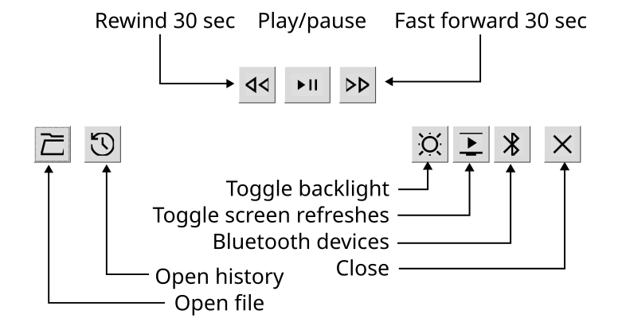

LARK - Libre Audiobook Reader for Kindle
========================================

<a href='https://ko-fi.com/E1E71RAR86' target='_blank'></a> <-- All proceeds go to charities.

LARK is a free **M4B** audiobook reader for jailbroken Kindles (currently arm-hf version only - firmware 5.16+).


It supports audiobooks in M4B format and AAC encoding. When downloading audiobooks, make sure to choose this format. AAC is the most common format for M4B audiobooks, however this format supports other encodings too.

[Librivox](https://librivox.org/search) has a good list of free public domain audiobooks created by the community. To get their books in M4B format, search them on [the Internet Archive](https://archive/org) and select *Librivox Apple Audiobook* as download format.

Features
--------

- Support for AAC encoded M4B audiobooks
- Uses [KinAMP](https://github.com/kbarni/KinAMP)'s audio engine and [FAAD2](https://github.com/knik0/faad2) decoder library
- Optimized for e-book readers: minimum screen refreshes, backlight management
- Listening history
- Scriptlet and KUAL launcher included

Installation and useage
-----------------------

Grab the latest relase from the [Releases](#) page. Unzip it to the root of your Kindle.

Start it from the library using the provided scriptlet or from KUAL.



Planned features
----------------

- Chapter management
- Bookmarks
- Other encodings

Building
--------

You must create your CMake toolchain file for your cross-compile toolchain.

You also need to get libfaad2 libraries (`.so`) and include (`.h`) files or [build them from source](https://github.com/knik0/faad2).

```
git clone 
cd LARK
mkdir build
cd build
cmake .. -DCMAKE_TOOLCHAIN_FILE=armhf-toolchain.cmake
make
```

Changelog
---------

- Version 1.0 - 1/3/2026
    - Initial release


License
-------

This program is free software: you can redistribute it and/or modify it under the terms of the **GNU General Public License** as published by the Free Software Foundation, either version 3 of the License, or (at your option) any later version. This program is distributed in the hope that it will be useful, but WITHOUT ANY WARRANTY; without even the implied warranty of MERCHANTABILITY or FITNESS FOR A PARTICULAR PURPOSE. See the GNU General Public License for more details. You should have received a copy of the GNU General Public License along with this program. If not, see <http://www.gnu.org/licenses/>.