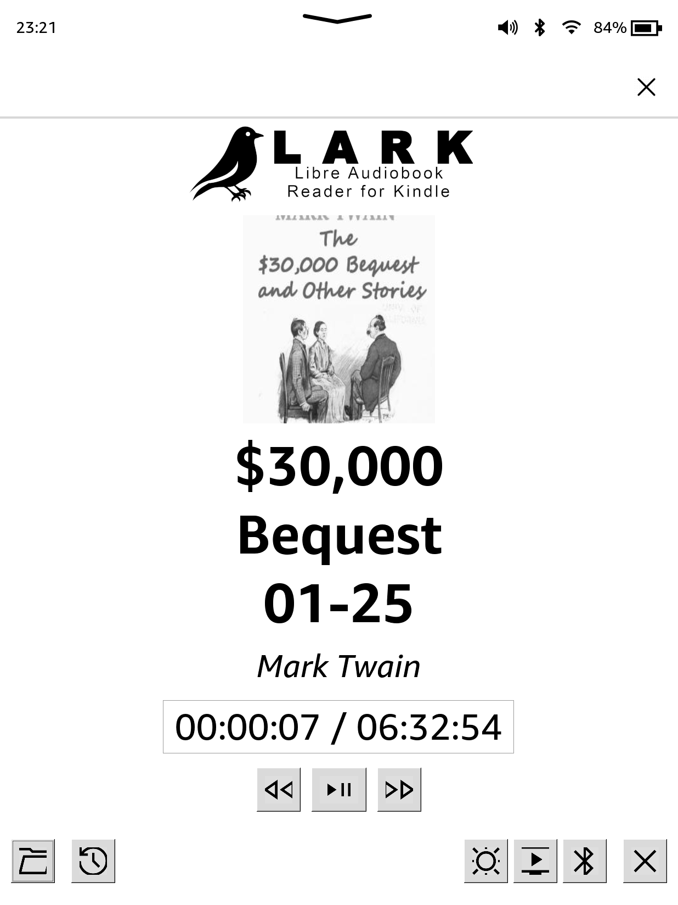

BARKPlayer - Better Audiobook Reader for Kindle
=============================================

BARKPlayer is a fork/improvement branch of [LARKPlayer](https://github.com/kbarni/LARKPlayer), a free **M4B** audiobook reader for jailbroken Kindles.

The goal of this fork is simple: keep the original Kindle-friendly M4B player idea, but make the project easier to build, package, debug, and extend.



Features
--------

- AAC encoded M4B audiobook playback through KinAMP-style audio output and FAAD2
- Kindle-oriented GTK2 UI with low screen refresh pressure
- Front-light, Bluetooth, display-refresh, history, chapter, and bookmark controls
- SQLite-backed listening history
- Legacy `.lark_history` migration support
- Chapter selection for M4B files that expose chapter metadata
- Bookmark support
- GitHub Actions workflow for packaging and Kindle cross-build attempts

Installation and usage
----------------------

Grab the latest release artifact from GitHub Actions or the Releases page when available. Unzip it to the root of your Kindle and start it from KUAL/scriptlet.

For manual launch from `kterm`:

```sh
cd BARKPlayer
./start_bark.sh
```

Getting free audiobooks
-----------------------

[Librivox](https://librivox.org/search) has a large list of free public domain audiobooks created by the community. To get their books in M4B format, look for the *Download M4B* link on the book page.

You can also create your own M4B files from other audio files with tools such as [AudiobookConverter](https://github.com/yermak/AudioBookConverter) or [M4B-Tool](https://github.com/sandreas/m4b-tool).

Building
--------

BARKPlayer targets jailbroken Kindle devices, so a normal desktop Linux runner is not enough for the final binary. You need:

- A Kindle-compatible ARM hard-float C/C++ toolchain
- GTK2 headers/libs from the Kindle/userstore SDK or compatible sysroot
- GStreamer 0.10 headers/libs
- FAAD2 headers/libs
- Kindle LIPC headers/libs
- SQLite3 and libxml2

Typical local build:

```sh
git clone https://github.com/Teknoist/BARKPlayer.git
cd BARKPlayer
mkdir -p build
cd build
cmake .. -DCMAKE_TOOLCHAIN_FILE=../armhf-toolchain.cmake
make -j$(nproc)
```

GitHub Actions
--------------

The workflow in `.github/workflows/build.yml` does two things:

1. Always creates a source/package artifact so the repo output is downloadable.
2. Attempts a real Kindle build when `armhf-toolchain.cmake` and the required Kindle/FAAD/LIPC libraries are present in the repository or runner environment.

This keeps CI useful even before the private Kindle SDK/toolchain files are added.

Troubleshooting
---------------

If BARKPlayer does not start, run it from `kterm` and copy the error:

```sh
cd BARKPlayer
./start_bark.sh
```

If you get a `libm.so` related error, especially on Kindle Scribe, remove `libm.so.6` from the bundled `libs_hf` folder and retry.

Changelog
---------

- Version 2.1 - BARKPlayer fork cleanup
  - Project renamed to BARKPlayer/barkplayer
  - CMake dependency handling improved
  - Missing SQLite database manager restored
  - GitHub Actions packaging/build workflow added
  - README and launch instructions updated
- Version 2.0 - 2026-01-10
  - History stored in SQLite database
  - Chapter selection
  - Bookmark support
  - Bugfixes and cosmetic changes
- Version 1.0 - 2026-01-03
  - Initial upstream release

License
-------

This program is free software: you can redistribute it and/or modify it under the terms of the **GNU General Public License** as published by the Free Software Foundation, either version 3 of the License, or (at your option) any later version.

This program is distributed in the hope that it will be useful, but WITHOUT ANY WARRANTY; without even the implied warranty of MERCHANTABILITY or FITNESS FOR A PARTICULAR PURPOSE. See the GNU General Public License for more details.
